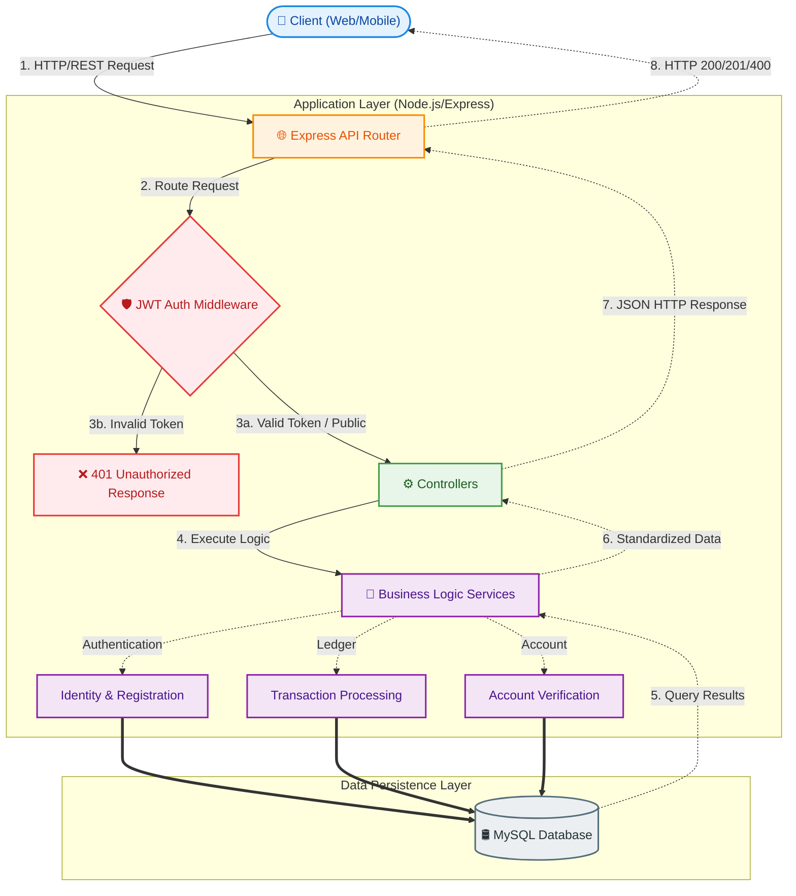

<div align="center">

# 🏦 SmartBank Core API

> **A robust, secure, and modern core banking RESTful API engineered for reliable financial operations.**

[](https://nodejs.org/)
[](https://expressjs.com/)
[](https://www.mysql.com/)

</div>

---

## 📖 Table of Contents
- [Introduction](#-introduction)
- [System Architecture](#-system-architecture)
- [Technology Stack](#-technology-stack)
- [Project Structure](#-project-structure)
- [API Reference Manual](#-api-reference-manual)
- [Getting Started](#-getting-started)
- [Environment Variables](#-environment-variables)

---

## 🌟 Introduction

**SmartBank API** provides essential backend banking services, prioritizing **data integrity**, **security**, and **scalability**. It handles user identity management, account provisioning, and transactional processing with strict validation and authorization controls.

Whether you're building a web frontend, a mobile application, or a third-party microservice, this backend serves as a secure, fast, and consistent single source of truth for all ledger and user data.

---

## 🏛️ System Architecture

The core of SmartBank operates on a standard multi-tier architectural pattern. We isolate route definitions, middleware validation, business logic, and database interactions to maintain high cohesion and low coupling.



---

## 🛠️ Technology Stack

The application is built leveraging a modern Javascript/Node environment, ensuring performant non-blocking I/O operations crucial for high-throughput financial data processing.

| Domain | Technology | Description |
| :--- | :--- | :--- |
| **Runtime** | `Node.js` | Asynchronous event-driven JavaScript runtime. |
| **Framework** | `Express.js` | Fast, unopinionated web framework for Node.js. |
| **Database** | `MySQL` | High-performance relational database management system. |
| **Security** | `jsonwebtoken` / `bcryptjs` | JWT for stateless, secure auth and bcrypt for robust password hashing. |
| **Utilities** | `cookie-parser` / `dotenv` | Secure HTTP cookie parsing and environment variable configuration isolation. |
| **Emailing** | `nodemailer` | Sending automated emails utilizing the secure Gmail API (OAuth2). |
| **Tooling** | `pnpm` / `nodemon` | Fast, disk-space efficient package manager and auto-reloading dev server. |

---

## 🏗️ Project Structure

A clean, modular directory topology to enforce the separation of concerns:

```text
SmartBank/
├── .env                     # 🔒 Local environment variables (Git Ignored)
├── package.json             # 📦 Project manifest, scripts, and dependencies
├── server.js                # 🚀 Application bootstrapper and HTTP server binding
└── src/
    ├── app.js               # 🔌 Express App setup, global middleware, routing
    ├── config/              # ⚙️ Infrastructure and database connection setup
    ├── controllers/         # 🧠 Request validation and response orchestrators
    ├── middleware/          # 🛡️ Interceptors (Security, Auth, Error Handling)
    ├── models/              # 🗃️ Database schemas, queries, and migrations
    ├── routers/             # 🧭 URL Path definitions and HTTP Verb mappings
    └── services/            # 💼 Domain-specific business/external logic
```

---

## 📡 API Reference Manual

The API is structured following standard REST conventions, responding with standard HTTP status codes and strict `application/json` structured payloads.

### 🌐 System Health Check
Verify that the core API server is online and accepting connections.
| Method | Endpoint | Description | Auth Validation |
| :--- | :--- | :--- | :---: |
| `GET` | `/` | Confirms the API server root is operational. | ❌ (Public) |

### 🔐 1. Identity Verification (Authentication)
Endpoints governing user lifecycle, creation, and secure JWT-based identity management.
| Method | Endpoint | Description | Auth Validation |
| :--- | :--- | :--- | :---: |
| `POST` | `/api/auth/register` | Provisions a new user identity and securely hashes credentials. | ❌ (Public) |
| `POST` | `/api/auth/login` | Authenticates user credentials, issuing a secure JWT HTTP-only cookie. | ❌ (Public) |
| `POST` | `/api/auth/logout` | Safely terminates the active session by invalidating auth cookies. | ❌ (Public) |

### 🏦 2. Account Management
Endpoints responsible for the creation and data retrieval of financial user accounts.
| Method | Endpoint | Description | Auth Validation |
| :--- | :--- | :--- | :---: |
| `POST` | `/api/accounts/` | Provisions a fresh, zero-balance bank account mapped to the active user. | ✅ (User JWT) |
| `GET` | `/api/accounts/` | Retrieves a comprehensive array of all existing accounts owned by the user. | ✅ (User JWT) |
| `GET` | `/api/accounts/balance/:id` | Queries the exact, real-time decimal balance of the specified account ID. | ✅ (User JWT) |

### 💸 3. Transactional Ledger
Endpoints facilitating monetary transfers and auditable ledger operations.
| Method | Endpoint | Description | Auth Validation |
| :--- | :--- | :--- | :---: |
| `POST` | `/api/transactions/` | Initiates a standard peer-to-peer or internal multi-account funds transfer. | ✅ (User JWT) |
| `POST` | `/api/transactions/system/initial-funds`| System-level administrative endpoint to deposit startup capital into user accounts. | 🛡️ (System JWT) |

---

## 🚀 Getting Started

Follow these rigorous instructions to safely provision the core banking backend in your local development environment.

### 1. Prerequisites
Ensure your local host machine has the following tools installed and accessible via system PATH:
- **Node.js**: `v18.0.0` or greater
- **MySQL**: `v8.0` or greater (A running daemon accepting TCP connections)
- **PNPM**: Package manager (install via `npm i -g pnpm`)

### 2. Standard Installation

Clone the repository and jump into the directory:
```bash
git clone <your-repo-link> SmartBank
cd SmartBank
```

Install the strict dependency tree defined in `pnpm-lock.yaml`:
```bash
pnpm install
```

### 3. Database Initialization
1. Open your MySQL client (e.g., MySQL Workbench, DBeaver, or CLI).
2. Create the target relational database:
   ```sql
   CREATE DATABASE smartbank_db;
   ```
3. *(Ensure your tables are migrated according to your `models/` or Prisma/Sequelize configurations).*

### 4. Running the Development Server
Execute the hot-reloading Nodemon server. This is optimal for local development:
```bash
pnpm run dev
```
*Expected Terminal Output:*
> `Server is listening on port 4000`

---

## 🔒 Environment Variables

You must supply a `.env` file at the root of the `./SmartBank` directory. Note: Never commit this file to version control.

| Variable Name | Type | Description | Default / Example |
| :--- | :--- | :--- | :--- |
| `PORT` | Number | TCP Port for Express to bind onto. | `4000` |
| `DB_HOST` | String | FQDN or IP of the MySQL server. | `localhost` or `127.0.0.1` |
| `DB_USER` | String | Privileged MySQL username. | `root` |
| `DB_PASSWORD` | String | Secure password for the MySQL user. | `s3cr3t_p@ssw0rd` |
| `DB_NAME` | String | Target logical database name. | `smartbank_db` |
| `JWT_SECRET` | String | High-entropy string for signing user Auth tokens. | `a_very_long_random_string_here` |
| `CLIENT_ID` | String | Google OAuth2 Client ID for Gmail API authentication. | `851176822...googleusercontent.com` |
| `CLIENT_SECRET` | String | Google OAuth2 Client Secret for Gmail API. | `GOCSPX-your_secret` |
| `REFRESH_TOKEN` | String | Google OAuth2 Refresh Token for continuous email service. | `1//your_google_refresh_token` |
| `EMAIL_USER` | String | The origin Gmail address used for dispatching platform emails. | `your_email@gmail.com` |

---

## 📚 Resources

<!-- Helpful developer references and documentation:
  - MySQL Transactions: http://geeksforgeeks.org/mysql/mysql-transaction/
  - Nodemailer OAuth2: https://nodemailer.com/smtp/oauth2/
  - Express Security: https://expressjs.com/en/advanced/best-practice-security.html
-->

- [Understanding MySQL Transactions (GeeksforGeeks)](http://geeksforgeeks.org/mysql/mysql-transaction/)

---

**Author:** ajay
