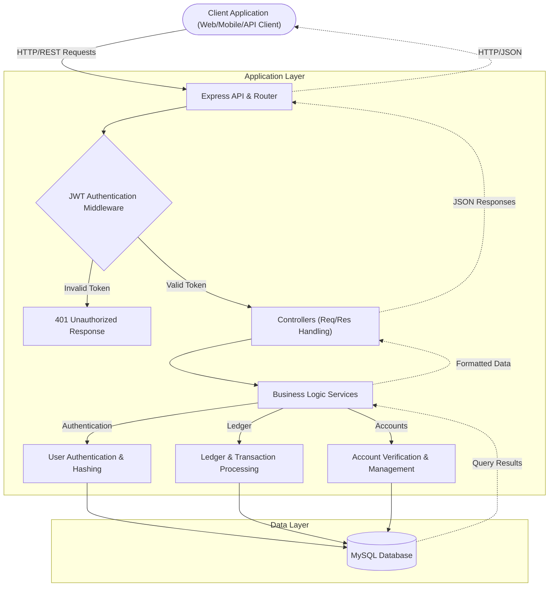

# SmartBank Core API

> A robust, secure, and modern core banking RESTful API backend engineered for reliable financial operations. 

SmartBank API provides essential banking services, prioritizing data integrity, security, and scalability. It handles user authentication, account management, and transactional processing with strict validation and authorization controls.

---

## 🏛️ System Architecture Workflow

The system employs a standard multi-tier architectural pattern, utilizing middleware for secure request validation before business logic execution.



---

## 🛠️ Technology Stack

The application is built upon a modern Node.js stack, ensuring performant non-blocking I/O operations suitable for financial data processing.

### Core Technologies
- **Runtime Environment:** [Node.js](https://nodejs.org/)
- **Web Framework:** [Express.js](https://expressjs.com/)
- **Database Management System:** [MySQL](https://www.mysql.com/)

### Key Libraries & Modules
- **Authentication & Security:** 
  - `jsonwebtoken` (JWT specification for stateless authentication)
  - `bcryptjs` (Cryptographic hashing for credential security)
  - `cookie-parser` (Secure HTTP cookie management)
- **Database Driver:** `mysql2` (High-performance MySQL client)
- **Configuration Management:** `dotenv` (Environment variable isolation)
- **Development Tooling:** `nodemon` (Hot-reloading), `pnpm` (Fast deterministic dependency resolution)

---

## 🚀 Getting Started

Follow these instructions to provision the application in your local development environment.

### Prerequisites

Ensure the following dependencies are installed on your host machine:
- Node.js (v18.x or higher)
- MySQL Server (v8.x or higher)
- PNPM Package Manager (v10.x or higher)

### Environment Configuration

1. Clone the repository and navigate to the project directory:
   ```bash
   cd SmartBank
   ```

2. Duplicate the environment template (if available) or create a fresh `.env` file in the repository root:
   ```env
   # Server Configuration
   PORT=4000
   
   # Database Configuration
   DB_HOST=127.0.0.1
   DB_USER=root
   DB_PASSWORD=your_secure_password
   DB_NAME=smartbank_db
   
   # Security
   JWT_SECRET=your_cryptographically_secure_random_string
   ```

### Installation

Install the required dependencies using the PNPM package manager:
```bash
pnpm install
```

### Execution

To initialize the development server with hot-reloading enabled:
```bash
pnpm run dev
```
*The server will typically bind to `http://localhost:4000` depending on your environment variables.*

---

## 📡 API Reference Manual

The API is structured around REST principles, responding to standard HTTP verbs and utilizing JSON for payload delivery.

### 1. Identity Verification (Authentication)
Endpoints governing user lifecycle and identity management.

| Method | Endpoint | Description | Auth Required |
| :--- | :--- | :--- | :---: |
| `POST` | `/api/auth/register` | Provisions a new user identity in the system. | ❌ |
| `POST` | `/api/auth/login` | Authenticates credentials and issues a secure JWT cookie. | ❌ |
| `POST` | `/api/auth/logout` | Invalidates the active session and clears HTTP cookies. | ❌ |

### 2. Account Management
Endpoints responsible for the creation and querying of financial accounts.

| Method | Endpoint | Description | Auth Required |
| :--- | :--- | :--- | :---: |
| `POST` | `/api/accounts/` | Provisions a new bank account associated with the authenticated user. | ✅ |
| `GET` | `/api/accounts/` | Retrieves a comprehensive list of accounts owned by the authenticated user. | ✅ |
| `GET` | `/api/accounts/balance/:accountId` | Retrieves the precise current balance of the specified account. | ✅ |

### 3. Transactional Processing (Ledger)
Endpoints facilitating monetary movements and ledger operations.

| Method | Endpoint | Description | Auth Required |
| :--- | :--- | :--- | :---: |
| `POST` | `/api/transactions/` | Initiates a peer-to-peer or multi-account fund transfer. | ✅ |
| `POST` | `/api/transactions/system/initial-funds`| System/Admin endpoint to deposit initial startup capital securely. | ✅ (System) |

---

## 🏗️ Directory Taxonomy

A high-level overview of the architectural boundaries within the repository:

```text
SmartBank/
├── .env                     # Local environment configuration
├── package.json             # Project manifest and scripts
├── server.js                # Application bootstrapper and HTTP server binding
└── src/
    ├── app.js               # Express application initialization and middleware piping
    ├── config/              # Infrastructure and database connection topologies
    ├── controllers/         # HTTP request/response orchestrators
    ├── middleware/          # Interceptors for authentication and request validation
    ├── models/              # Database schema definitions and SQL queries
    ├── routers/             # Endpoint routing and URI path definitions
    └── services/            # Domain-specific business logic encapsulation
```

---

## ⚖️ Licensing

This software is licensed under the **ISC License**.

*Developed by ajay.*
